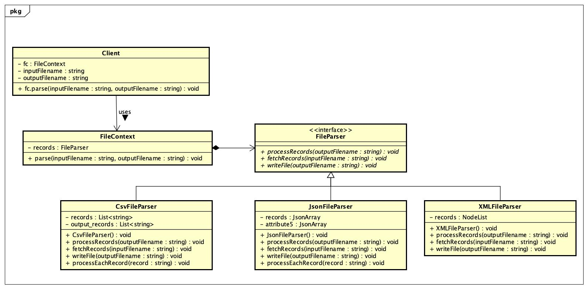
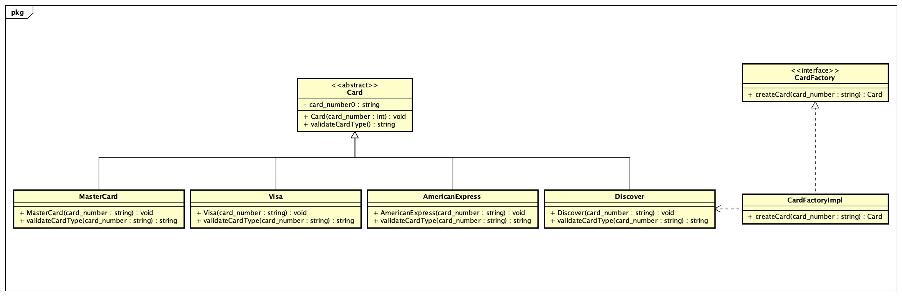

# Credit Card Java Application

Credit Card App is a console application which is developed using Java implementing various Design Patterns. 
This Application lets the user to provide the Credit Card records for which the application determines the type of the Credit Card.

The user can provide the records in various files including CSV, JSON, XML. 
The application reads a record from the file, verifies that the credit card number is a possible account number, and creates an instance of the appropriate credit card class. 
The files contain credit card information. It contains field for credit card number, expiration date, and the name of the card holder.

The design patterns implemented are:
1. Strategy Pattern.
2. Iterator Pattern.
3. Factory Method Pattern.

The Class Diagrams for these design patterns are as follows:

1. Strategy Pattern


2. Iterator Pattern


3. Factory Method Pattern


## Getting Started
- Clone the Repository.
- Get the following Jar files for executing the Application.
    * commons-text-1.8.jar
    * json-simple-1.1.1.jar
    * commons-lang3-3.10.jar
- Get the libraries for execution
    * junit-4.12
    * hamcrest-core-1.3
- Include the Jar files in the IDEA.
- Compile the java files and obtain the class files.
- Run the client (Main) class file as given below.
    * Go to CreditCard/out/production/CreditCard directory using the terminal.
    * All the compiled classes are present in CreditCard/out/production/CreditCard/com/ directory.
    * In order to run the Application using the CSV File, the command to run the main class is:
         ```
        java com.Client Sample.csv Output.csv
        ```
    * To run the Application using the XML File, the command to run the main class is:
        ```
        java com.Client Sample.xml Output.xml
        ```
    * To run the Application using the JSON File, the command to run the main class is:
        ```
        java -cp .:/<Path to the source folder>/CreditCard/json-simple-1.1.1.jar com.Client Sample.json Output.json
        ```
- The Junit Unit testing can be performed from their respective classes.

